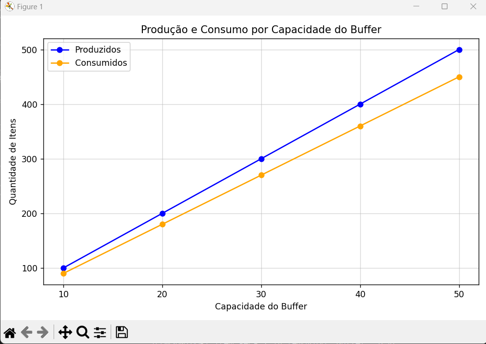

# Sistema de Produtores e Consumidores

Este projeto implementa uma simulação do problema clássico de **Produtores e Consumidores** com um buffer compartilhado e gera gráficos de análise.

## Gráfico

- Gera um gráfico de comparativos de produção e consumo.


## Funcionalidades

- Simula a interação entre produtores e consumidores usando multithreading.
- Controla a capacidade do buffer usando semáforos.
- Gera gráficos comparativos de produção e consumo.

## Requisitos

Certifique-se de ter os seguintes pacotes instalados:

- Python 3
- `pandas`
- `matplotlib`

Para instalar as dependências:
```bash
pip install pandas matplotlib
